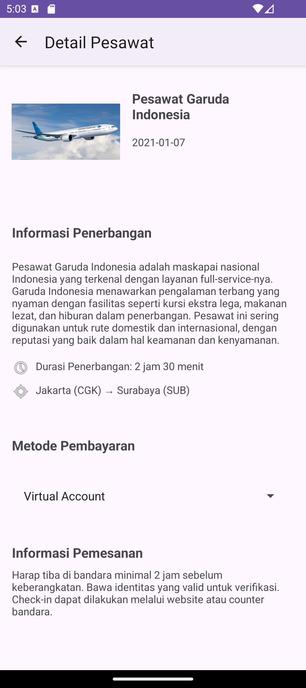

# Final Submission Basic Android Dicoding

## Introduction

This is a final submission for the basic android class at Dicoding. This project topic is about a simple plane ticket booking application.

## Features

- User can see a list of plane tickets
- User can see the detail of a plane ticket
- About page

## Installation

1. Clone this repository
2. Open the project with Android Studio
3. Run the project
4. Done

## Screenshots

| Screenshot | Description |
|------------|-------------|
|  | Home Screen |
|  | Detail Screen |
|  | About Screen |
|  | Grid Screen |

## Author

- M. Rizky Haksono